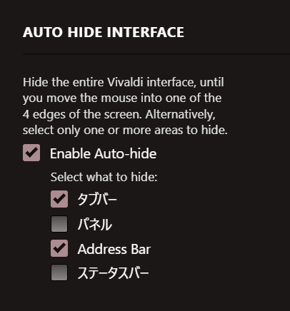

# Vivaldi Custom Tile-Style Tab Bar 🎨

A CSS theme that turns the Vivaldi sidebar tabs into a tiled grid layout, designed to work seamlessly with the AutoHide feature.

**Want a workspace experience like ZenBrowser?**

<video src="tmp/demo.mp4" controls width="100%"></video>

## 📋 Requirements
Available in **[Snapshot 3899.3](https://vivaldi.com/blog/desktop/daily-images-autohide-toolbars-smarter-tab-tiling-vivaldi-browser-snapshot-3899-3/)** or later.

## 🚀 Installation & Setup

1. **Tab Position**: Set the Tab Bar position to **Left** in Settings.
2. **Enable CSS Modifications**: Go to `vivaldi:flags`, search for **Allow CSS modifications**, and set it to **Enabled**.
3. **AutoHide Settings**: Enable **Tab** and **Address** in the **AutoHideInterface** settings (if applicable in your version).

## ZenBrowser-Style Workspaces

To achieve a workflow similar to ZenBrowser:

1. Enable **Workspaces** in Vivaldi settings.
2. Place the **Workspace** button on your toolbar (or use Command Chains).
3. Assign custom images as icons for your workspaces.

For a detailed guide, check out this article:
[Pawel shows you how to play with Workspaces and Custom Icons in Vivaldi](https://vivaldi.com/blog/pawel-shows-you-how-to-play-with-workspaces-and-custom-icons-in-vivaldi/)
